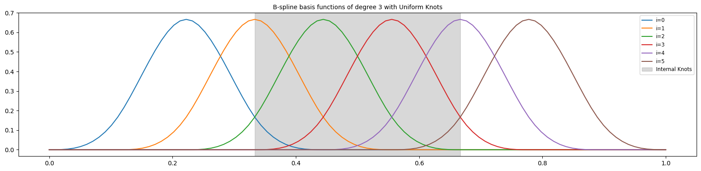
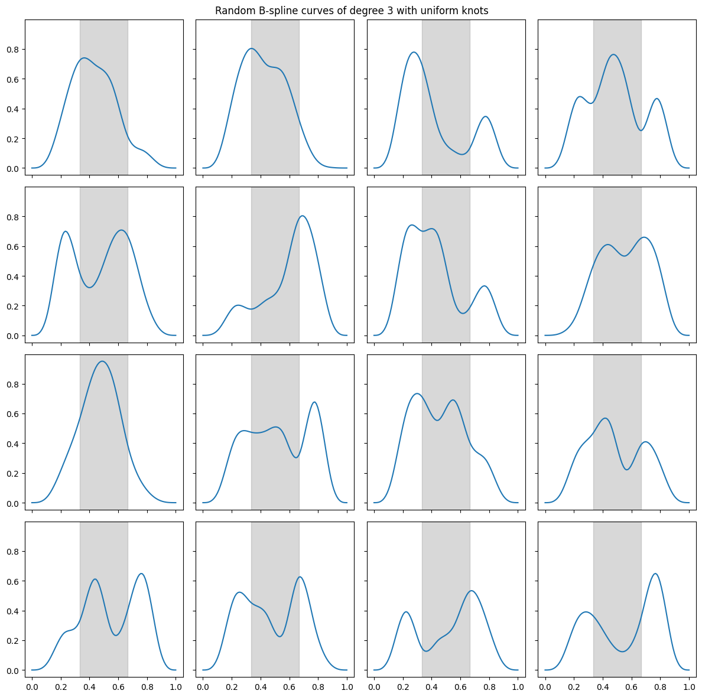

# B-spline Curves

## Theory

> reference: [B-splines curves and surfaces](https://web.mit.edu/hyperbook/Patrikalakis-Maekawa-Cho/node15.html)

### Basis Functions

Basis functions are basic building blocks of all the functions in a function space. Every function in the function space can be represented as a linear combination of its basis functions.

> Think of exponentials that are basis functions of any periodic function that has a fourier series.

### Spline

A spline is a piecewise polynomial function $S: [a, b] \rightarrow \mathbb{R}$ with $m+1$ knots $t = [t_0, ..., t_m]$ where $a=t_0\le t_1 \le ... \le t_m=b$ and:

$$S(x) = P_i(x), \qquad x\in[t_i, t_{i+1})$$

for $i=0,..,m-1$.

If the polynomial pieces $P_i$ each have degree at most $p$, then the spline is said to be of degree $p$ or of order $p+1$.

### B-spline

A B-spline (basis spline) of order $p+1$ is a piecewise polynomial function $B_{i, k}(x)$ of degree $p$. B-splines are basis functions for spline functions of the same order and are defined as:

$$B_{i, 0}(x) = 1,\qquad if~x\in[t_i,t_{i+1}),~o.w.~0$$

and recursively:

$$B_{i, p}(x) = \frac{x - t_i}{t_{i+p}-t_i}B_{i, p-1}(x) + \frac{t_{i+p+1} - x}{t_{i+p+1}-t_{i+1}}B_{i+1, p-1}(x)$$

for $p > 0$, and $i=0,...,n-1$ , and $t = [t_0, ..., t_{n+p}]$.

### B-spline Curve

A B-spline curve is defined as a linear combination of B-spline basis functions with the knot vector $t = [t_0,..,t_p,..,t_n,..t_{n+p}]$:

$$S(x) = \sum_{i=0}^{n - 1} c_i B_{i, p}(x), \qquad x\in[t_{p}, t_{n}]: \text{internal knots}$$

with $n > p$.

## Implementation

```python
import numpy as np
from matplotlib import pyplot as plt
```

### Scaler

```python
def b(x, i, p, t):
    if p == 0:
        return 1 if t[i] <= x < t[i + 1] else 0
    c_1 = (x - t[i]) / (t[i + p] - t[i])
    c_2 = (t[i + p + 1] - x) / (t[i + p + 1] - t[i + 1])
    b_ip = c_1 * b(x, i, p - 1, t) + c_2 * b(x, i + 1, p - 1, t)
    return b_ip


def b_curve(x, c, p, t):
    return sum([ci * b(x, i, p, t) for i, ci in enumerate(c)])
```

```python
p = 3  # dgree of polynomials
n = 6  # number of basis functions (> p)
m = n + p + 1  # number of knots
t = np.linspace(0, 1, m)  # uniform knot vector (t[p:n+1] are called internal knots)
x = np.linspace(t[0], t[-1], 100)

fig, ax = plt.subplots(figsize=(16, 4))
for i in range(n):
    y = [b(xi, i, p, t) for xi in x]
    ax.plot(x, y, label=f"i={i}")
ax.axvspan(t[p], t[n], color="gray", alpha=0.3, label="Internal Knots")
ax.set_title(
    "B-spline basis functions of degree 3 with Uniform Knots", fontsize="medium"
)
ax.legend(fontsize="small")
fig.tight_layout()
```



```python
fig, ax = plt.subplots(4, 4, figsize=(12, 12), sharex=True, sharey=True)
ax = ax.flatten()

for i in range(16):
    c = np.random.random(n)
    y = [b_curve(xi, c, p, t) for xi in x]
    ax[i].plot(x, y)
    ax[i].axvspan(t[p], t[n], color="gray", alpha=0.3)
fig.suptitle("Random B-spline curves of degree 3 with uniform knots")
fig.tight_layout()
```



### Batch

If x is a batch of shape $(N, d)$, with simple modification we can have the batched version of the basis functions.

```python
def b_batch(x, i, p, t):
    if p == 0:
        out = (t[i] <= x) * (x < t[i + 1])
        return out.astype(int)
    c_1 = (x - t[i]) / (t[i + p] - t[i])
    c_2 = (t[i + p + 1] - x) / (t[i + p + 1] - t[i + 1])
    b_ip = c_1 * b_batch(x, i, p - 1, t) + c_2 * b_batch(x, i + 1, p - 1, t)
    return b_ip
```

### Batch for all bases

```python
# For all i = 0, ..., n-1
def b_vectorized(x, p, t):
    m = t.shape[0]
    n = m - p - 1
    t = t.reshape(-1, 1, 1)
    if p == 0:
        out = (t[:-1] <= x) * (x < t[1:])
        return out.astype(int)

    c_1 = (x - t[:n]) / (t[p : p + n] - t[:n])
    c_2 = (t[p + 1 : n + p + 1] - x) / (t[p + 1 : n + p + 1] - t[1 : n + 1])
    b_pm1 = b_vectorized(x, p - 1, t)
    b_p = c_1 * b_pm1[:-1] + c_2 * b_pm1[1:]
    return b_p
```

```python
p = 3  # dgree
n = 6  # number of basis functions (> p)
m = n + p + 1  # number of knots
N = 16  # batch size
d = 8  #
t = np.linspace(0, 1, m)  # uniform knot vector (t[p:n+1] are called internal knots)
x = np.random.random((N, d))
B = b_vectorized(x, p, t)
B.shape
```

    (6, 16, 8)

### Batch for all bases with different knot vectors

```python
def b_vectorized(x, p, t):
    m, d = t.shape
    n = m - p - 1
    t_ = t.reshape(m, 1, d)
    if p == 0:
        out = (t_[:-1] <= x) * (x < t_[1:])
        return out.astype(int)

    c_1 = (x - t_[:n]) / (t_[p : p + n] - t_[:n])
    c_2 = (t_[p + 1 : n + p + 1] - x) / (t_[p + 1 : n + p + 1] - t_[1 : n + 1])
    b_pm1 = b_vectorized(x, p - 1, t)
    b_p = c_1 * b_pm1[:-1] + c_2 * b_pm1[1:]
    return b_p
```

```python
p = 3  # dgree
n = 6  # number of basis functions (> p)
m = n + p + 1  # number of knots
N = 16  # batch size
d = 8  #
t = np.sort(
    np.random.random((m, d)), axis=1
)  # uniform knot vector (t[p:n+1] are called internal knots)
x = np.random.random((N, d))
B = b_vectorized(x, p, t)
B.shape
```

    (6, 16, 8)
