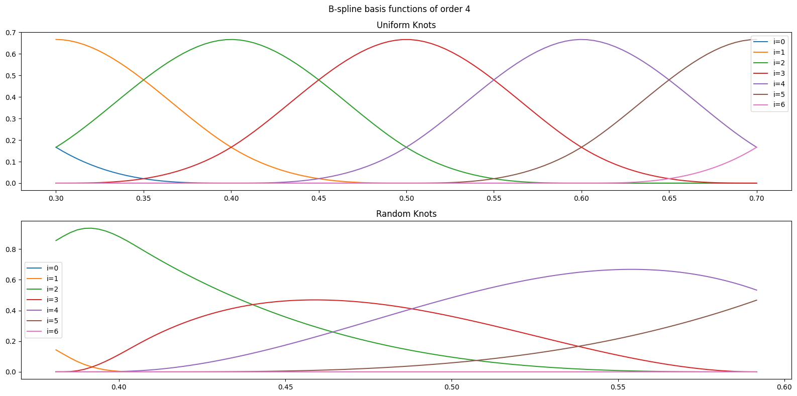
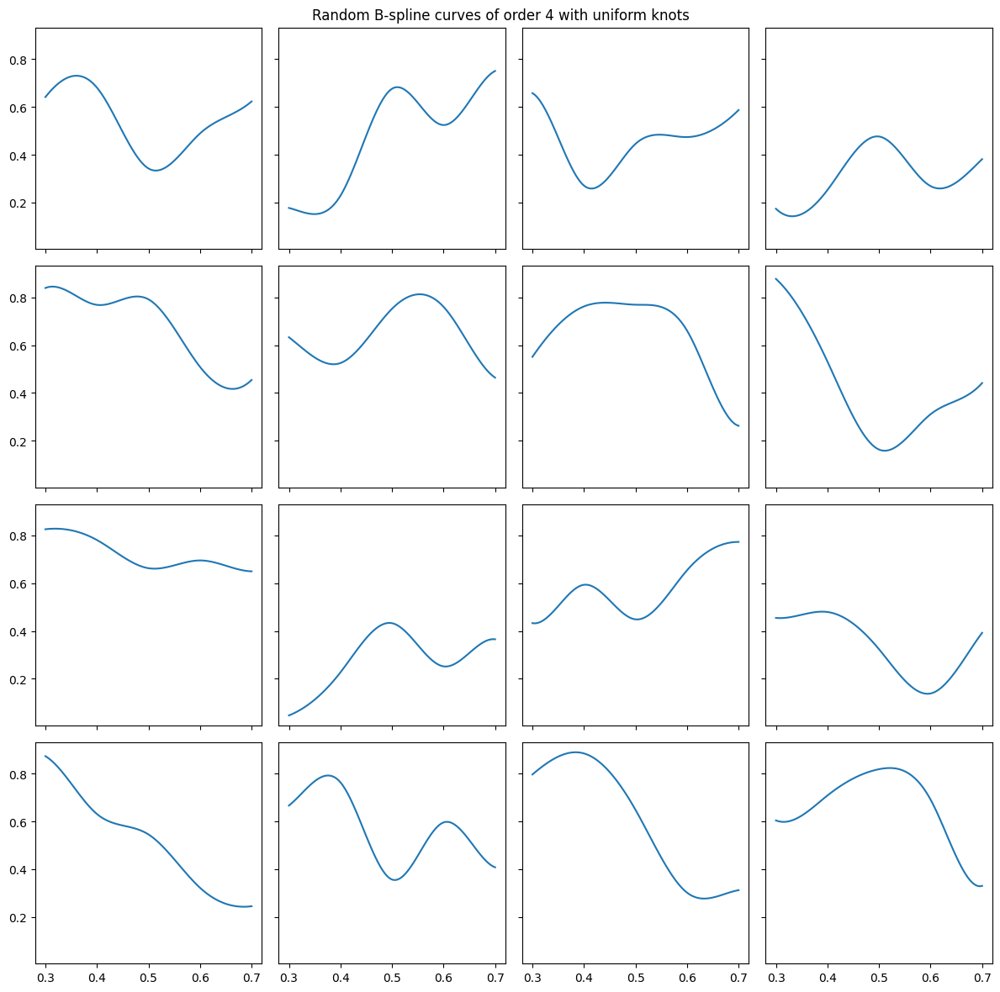

# Basics

## Basis Functions

Basis functions are basic building blocks of all the functions in a function space. Every function in the function space can be represented as a linear combination of its basis functions.

> Think of exponentials that are basis functions of any periodic function that has a fourier series.

## Spline

A spline is a piecewise polynomial function $S: [a, b] \rightarrow \mathbb{R}$ with $m+1$ knots $t = [t_0, ..., t_m]$ where $a=t_0\le t_1 \le ... \le t_m=b$ and:

$$S(x) = P_i(x), \qquad x\in[t_i, t_{i+1})$$

for $i=0,..,m-1$.

If the polynomial pieces $P_i$ each have degree at most $k-1$, then the spline is said to be of degree $k-1$ or of order $k$.

## B-spline

A B-spline (basis spline) of order $k$ is a piecewise polynomial function $B_{i, k}(x)$ of degree $k-1$. B-splines are basis functions for spline functions of the same order and are defined as:

$$B_{i, 1}(x) = 1,\qquad if~x\in[t_i,t_{i+1}),~o.w.~0$$

and recursively:

$$B_{i, k}(x) = \frac{x - t_i}{t_{i+k-1}-t_i}B_{i, k-1}(x) + \frac{t_{i+k} - x}{t_{i+k}-t_{i+1}}B_{i+1, k-1}(x)$$

for $k > 1$, and $i=0,...,n$ , and $t = [t_0, ..., t_{n+k}]$.

## B-spline Curve

A B-spline curve is defined as a linear combination of B-spline basis functions with the knot vector $t = [t_0,..,t_k,..,t_n,..t_{n+k}]$:

$$S(x) = \sum_{i=0}^{n} c_i B_{i, k}(x), \qquad x\in[t_{k-1}, t_{n+1}]$$

with $n \ge k-1$.

> reference: [B-splines curves and surfaces](https://web.mit.edu/hyperbook/Patrikalakis-Maekawa-Cho/node15.html)

